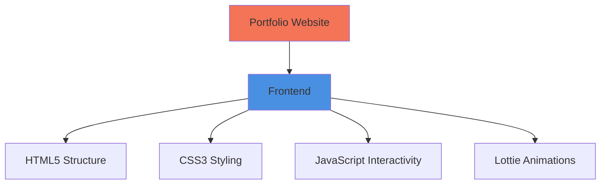

#  Asad Ishaq's Portfolio

### ✨ Personal Portfolio Website

## 🎨 Technologies Used

- **Frontend:** HTML5, CSS3, JavaScript
- **Tools:** Git, GitHub, Vercel, LottieFiles, Motion

## 📊 Performance Metrics

## 🏗️ Architecture Overview

## 📸 Preview

## 🤝 Connect With Me

### ⭐ **If you like this portfolio, give it a star on GitHub!**

**Built with ❤️ by [Asad Ishaq](https://github.com/axadishaq)**

